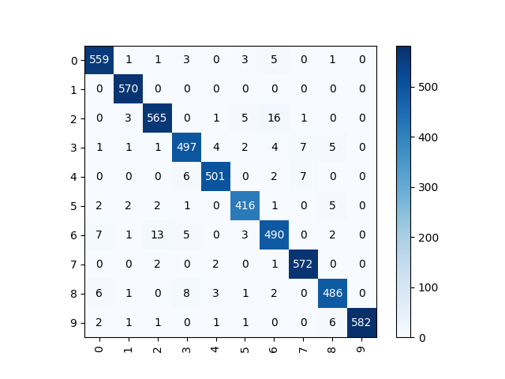
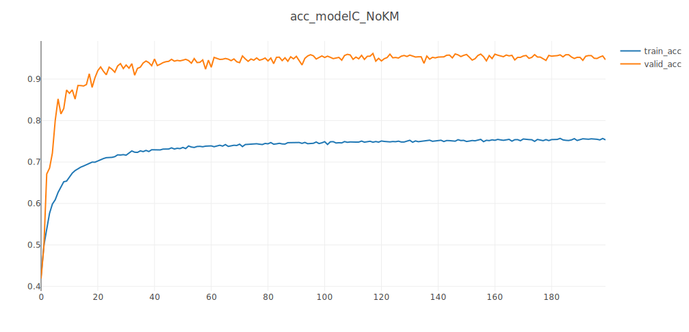

# hw2: report

**姓名：周泽龙**
**学号：2020213990**
**课程：深度学习**
**日期：2021年4月16日**

------

## Task A: Large-Scale Learning

#### 1. Training and test curves [10pts]

Use Visdom to visualize training and test curves. Model A (ResNet50) achieves **94.80%** accuracy on the **large-scale training** set and **96.63%** accuracy on the **test** set. The training and test curves are as follows:

#### 2. t-SNE Visualization [10pts]

Visualize the features before the last fully-connected layer using **t-SNE**. Select **500** pictures from the test set (**50 pictures per category**), and the tSNE distribution diagram of the **label** is as follows:

#### 3. conv Visualization [10pts]

Use `AnnualCrop_11.jpg` in the test set to visualize the convolutional layer features of model A (display up to 4 images). According to the order from top to bottom and left to right (the first one in the upper left corner is the input), the results are as follows:

## Task B: Medium-Scale Learning

Inspired by the dilated convolution [1], my model B will use 3 convolution kernels with different dilation rates to replace part of the convolutional layer of resNet (replace `BasicBlock` with `DilateBlock` in the code), as shown in the figure below. The following experiments will focus on these aspects:

* Different number of layers 
  * 18 & 34
* Different replacement (using dilate module in different layers)
  * [0,0,1,1] means layer1 and layer2 use `BasicBlock`, layer3 and layer4 use `DilateBlock`
* Data augmentation
  * RandomVerticalFlip、RandomHorizontalFlip
  * CenterCrop、RandomResizedCrop
* Learning rate strategy
  * Adam

#### 1. Training and test curves [10pts]

Sorry for not having enough time to go through all possible situations. The summary results are shown in the table below.

|                Model                | Training Accuracy | Test Accuracy |
| :---------------------------------: | :---------------: | :-----------: |
| **DilateNet18[0,0,0,0] (ResNet18)** |    **90.60%**     |  **86.01%**   |
|        DilateNet18[0,0,0,1]         |      91.60%       |    86.56%     |
|      **DilateNet18[0,0,1,1]**       |    **94.50%**     |  **87.76%**   |
|        DilateNet18[1,1,1,1]         |      92.90%       |    87.13%     |
|        DilateNet34[0,0,1,1]         |      89.50%       |    84.59%     |

**Result analysis:**

* Compared with the model (DilateNet18[0,0,0,0]) that does not use `DilateBlock`, the accuracy of the DilateNet18[0,0,1,1] is improved (training accuracy: 90.60% to 94.50%, test accuracy: 86.01% to 87.76%).
* Comparing DilateNet18[0,0,1,1] and DilateNet34[0,0,1,1], the depth of the model does not necessarily have a positive effect on the accuracy
* Different replacements have an impact on accuracy. In the limited experimental results, [0,0,1,1] is the best.

##### 1.1. DilateNet18 [0,0,0,0] (ResNet18)

Use Visdom to visualize training and test curves. Model B (**DilateNet18 [0,0,0,0] (ResNet18)**) achieves **90.60%** accuracy on the **medium-scale training** set and **86.01%** accuracy on the **test** set. The training and test curves are as follows:

##### 1.2. DilateNet18 [0,0,0,1]

Use Visdom to visualize training and test curves. Model B (**DilateNet18[0,0,0,1]**) achieves **91.60%** accuracy on the **medium-scale training** set and **86.56%** accuracy on the **test** set. The training and test curves are as follows:

##### 1.3. DilateNet18 [0,0,1,1]

Use Visdom to visualize training and test curves. Model B (**DilateNet18[0,0,1,1]**) achieves **94.50%** accuracy on the **medium-scale training** set and **87.76%** accuracy on the **test** set. The training and test curves are as follows:

##### 1.4. DilateNet18 [1,1,1,1]

Use Visdom to visualize training and test curves. Model B (**DilateNet18[1,1,1,1]**) achieves **92.90%** accuracy on the **medium-scale training** set and **87.13%** accuracy on the **test** set. The training and test curves are as follows:

##### 1.5. DilateNet34 [0,0,1,1]

Use Visdom to visualize training and test curves. Model B (**DilateNet18[0,0,1,1]**) achieves **89.50%** accuracy on the **medium-scale training** set and **84.59%** accuracy on the **test** set. The training and test curves are as follows:

#### 2. Data augmentation and learning rate strategy [10pts]

Sorry for not having enough time to go through all possible situations. Using **`RandomHorizontalFlip`** and **`RandomResizedCrop`**, the result of Model B is as 1.3 (DilateNet18 [0,0,1,1]). In addition, all experiments in 1 used **`Adam optimizer`** with  **`MultiStepLR`**.

The following experiments will all use DilateNet18 [0,0,1,1]. The summary results are shown in the table below.

|            Data Augmentation             | Learning Rate Strategy | Training accuracy | Test accuracy |
| :--------------------------------------: | :--------------------: | :---------------: | :-----------: |
| RandomHorizontalFlip + RandomResizedCrop |   Adam + MultiStepLR   |      94.50%       |    87.76%     |
|  RandomVerticalFlip + RandomResizedCrop  |   Adam + MultiStepLR   |      93.40%       |    86.72%     |
|    RandomHorizontalFlip + CenterCrop     |   Adam + MultiStepLR   |      100.00%      |    44.30%     |
| RandomHorizontalFlip + RandomResizedCrop |       SGD + None       |      92.60%       |    84.83%     |

**Result analysis:**

* Data augmentation method
  * In the limited experimental results, RandomHorizontalFlip + RandomResizedCrop provided by the start code is the best.
  * The results of training with CenterCrop are very poor
* Learning Rate Strategy
  * In the limited experimental results, Adam + MultiStepLR improves the accuracy of the model.

##### 2.1. RandomVerticalFlip

Use Visdom to visualize training and test curves. Using `RandomVerticalFlip`, Model B achieves **93.40%** accuracy on the **medium-scale training** set and **86.72%** accuracy on the **test** set. The training and test curves are as follows:

##### 2.2. CenterCrop

Use Visdom to visualize training and test curves. Using `CenterCrop`, Model B achieves **100.00%** accuracy on the **medium-scale training** set and **44.30%** accuracy on the **test** set. The training and test curves are as follows:

##### 2.3. No Learning Rate Strategy

Use Visdom to visualize training and test curves. Using `CenterCrop`, Model B achieves **92.60%** accuracy on the **medium-scale training** set and **84.83%** accuracy on the **test** set. The training and test curves are as follows:

## Task C: Weakly-Supervised Learning

In order to verify the universality of model B, I still use DilateNet18[0,0,1,1] as my model C for Weakly-Supervised Learning. Experimental results show that the accuracy of the model on the test set in Weakly-Supervised Learning is as high as 95.98%. Besides, I used **Kaiming Normal** for weight initialization. The following experiments all use RandomHorizontalFlip+RandomResizedCrop and Adam+MultiStepLR for training and will focus on these aspects:

* Compare with DilateNet18[0,0,0,0] (ResNet18) to verify the effectiveness of dilated convolution.
* Use Kaiming Normal or not.

#### 1. Training and test curves [20pts]

Use Visdom to visualize training and test curves. Model C (DilateNet18[0,0,1,1]) achieves **75.73%** accuracy on the **weakly-supervised training** set and **96.17%** accuracy on the **test** set. The training and test curves are as follows:

#### 2. Confusion matrix [10pts]

The confusion matrix of model C on test set is as follows:

#### 3. Extra techniques to improve [20pts]

1. Use 3 convolution kernels with different **dilation rates** to replace part of the convolutional layer of resNet
   - 
   - As shown in the figure above, using 3 convolution kernels with different dilation rates to share the same input, not only does not bring input loss, but because of the 3 different receptive fields, the effective information of the input is increased.
2. Used **Kaiming Normal** for weight initialization
   * For the effectiveness of Kaiming Initialization, please refer to Reference [2]. For more details, please refer to section 2.2 of the paper.

I used the above two techniques to improve the model C. The summary results are shown in the table below.

|      Extra Techniques      | Training accuracy | Test accuracy |
| :------------------------: | :---------------: | :-----------: |
|   Dilate+Kaiming Normal    |      75.73%       |    96.17%     |
|    Dilate (no kaiming)     |      75.69%       |    95.98%     |
| Kaiming Normal (no dilate) |                   |               |

##### 3.1 No Kaiming

Use Visdom to visualize training and test curves. Model C (DilateNet18[0,0,1,1]) **without** Kaiming Normal achieves **75.69%** accuracy on the **weakly-supervised training** set and **95.98%** accuracy on the **test** set. The training and test curves are as follows:

##### 3.2 No Dilate

Use Visdom to visualize training and test curves. DilateNet18[0,0,0,0] (ResNet18) **with** Kaiming Normal achieves **%** accuracy on the **weakly-supervised training** set and **%** accuracy on the **test** set. The training and test curves are as follows:

## references

[1] Wang, Panqu, et al. "Understanding convolution for semantic segmentation." *2018 IEEE winter conference on applications of computer vision (WACV)*. IEEE, 2018.

[2] He, Kaiming, et al. "Delving deep into rectifiers: Surpassing human-level performance on imagenet classification." *Proceedings of the IEEE international conference on computer vision*. 2015.

