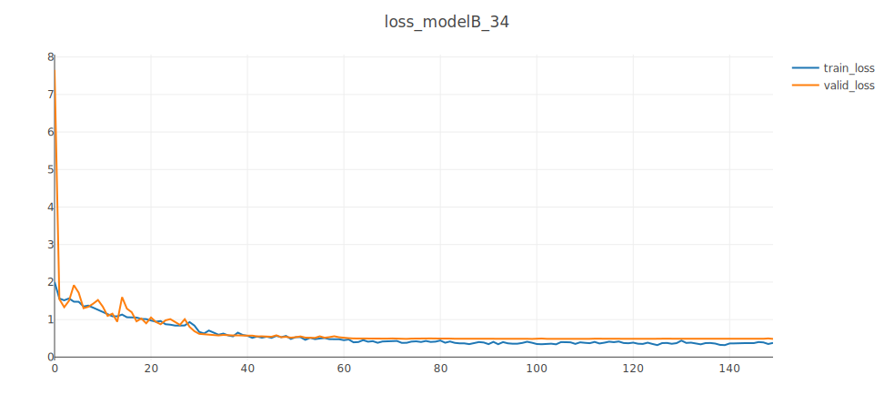

# hw2: report

**姓名：周泽龙**
**学号：2020213990**
**课程：深度学习**
**日期：2021年4月16日**

------

## Task A: Large-Scale Learning

#### 1. Training and test curves [10pts]

Use Visdom to visualize training and test curves. Model A (ResNet50) achieves **94.80%** accuracy on the **large-scale training** set and **96.63%** accuracy on the **test** set. The training and test curves are as follows:

#### 2. t-SNE Visualization [10pts]

Visualize the features before the last fully-connected layer using **t-SNE**. Select **500** pictures from the test set (**50 pictures per category**), and the tSNE distribution diagram of the **label** is as follows:

#### 3. conv Visualization [10pts]

Use `AnnualCrop_11.jpg` in the test set to visualize the convolutional layer features of model A (display up to 4 images). According to the order from top to bottom and left to right (the first one in the upper left corner is the input), the results are as follows:

## Task B: Medium-Scale Learning

Inspired by the dilated convolution, my model B will use 3 convolution kernels with different dilation rates to replace part of the convolutional layer of resNet (replace `BasicBlock` with `DilateBlock` in the code), as shown in the figure below. The following experiments will focus on these aspects:

* Different number of layers 
  * 18 & 34
* Different replacement (using dilate module in different layers)
  * [0,0,1,1] means layer1 and layer2 use `BasicBlock`, layer3 and layer4 use `DilateBlock`
* Data augmentation
  * RandomVerticalFlip、RandomHorizontalFlip
  * CenterCrop、RandomResizedCrop
* Learning rate strategy
  * Adam

#### 1. Training and test curves [10pts]

Sorry for not having enough time to go through all possible situations. The summary results are shown in the table below.

|              Model              | Training accuracy | Test accuracy |
| :-----------------------------: | :---------------: | :-----------: |
| DilateNet18[0,0,0,0] (ResNet18) |      90.60%       |    86.01%     |
|      DilateNet18[0,0,0,1]       |      91.60%       |    86.56%     |
|      DilateNet18[0,0,1,1]       |      94.50%       |    87.76%     |
|      DilateNet18[1,1,1,1]       |                   |               |
|      DilateNet34[0,0,1,1]       |      89.50%       |    84.59%     |

##### 1.1. DilateNet18 [0,0,0,0] (ResNet18)

Use Visdom to visualize training and test curves. Model B (**DilateNet18 [0,0,0,0] (ResNet18)**) achieves **90.60%** accuracy on the **medium-scale training** set and **86.01%** accuracy on the **test** set. The training and test curves are as follows:

##### 1.2. DilateNet18 [0,0,0,1]

Use Visdom to visualize training and test curves. Model B (**DilateNet18[0,0,0,1]**) achieves **91.60%** accuracy on the **medium-scale training** set and **86.56%** accuracy on the **test** set. The training and test curves are as follows:

##### 1.3. DilateNet18 [0,0,1,1]

Use Visdom to visualize training and test curves. Model B (**DilateNet18[0,0,1,1]**) achieves **94.50%** accuracy on the **medium-scale training** set and **87.76%** accuracy on the **test** set. The training and test curves are as follows:

##### 1.4. DilateNet18 [1,1,1,1]

Use Visdom to visualize training and test curves. Model B (**DilateNet18[1,1,1,1]**) achieves **%** accuracy on the **medium-scale training** set and **%** accuracy on the **test** set. The training and test curves are as follows:

##### 1.5. DilateNet34 [0,0,1,1]

Use Visdom to visualize training and test curves. Model B (**DilateNet18[0,0,1,1]**) achieves **89.50%** accuracy on the **medium-scale training** set and **84.59%** accuracy on the **test** set. The training and test curves are as follows:

#### 2. Data augmentation and learning rate strategy [10pts]

## Task C: Semi-Supervised Learning

#### 1. Training and test curves [20pts]

#### 2. Confusion matrix [10pts]

#### 3. extra techniques to improve [20pts]