# hw3: report

**姓名：周泽龙**
**学号：2020213990**
**课程：深度学习**
**日期：2021年5月16日**

------

[TOC]

<div STYLE="page-break-after: always;"></div>

## Task A: standard RNN [30pts]

In task A, I construct a standard RNN (including LSTM, GRU). Use Nvidia RTX 1080 to accelerate my experiment, the following experiments will focus on these aspects:

* RNN type
  * LSTM [1] & GRU [2]
* Different number of layers 
  * 1 & 2 & 4 & 8 & 16
* use gradient clip or not

```python
# Hyperparameter setting
ninput = 300
nhid = 300
lr = 0.001 if use Adam else 5
clip = 0.1
epochs = 100
train_batch_size = 20
eval_batch_size = 10
bptt = 100
dropout = 0.5
nlayers and nhead (Transformer) are control variables
```

#### 1. PPL & Time

Sorry for not having enough time to go through all possible situations. The summary results are shown in the table below.

| No.  |     Model      | Train PPL | Valid PPL  |  Test PPL  | ms/batch | Trainable params |
| :--: | :------------: | :-------: | :--------: | :--------: | :------: | :--------------: |
|  1   |   LSTM1_clip   |   48.28   |   125.68   |   119.51   |    43    |     20722478     |
|  2   | LSTM1_original |  943.23   |   662.08   |   622.36   |    53    |     20722478     |
|  3   | **LSTM2_clip** | **56.27** | **123.40** | **116.42** |  **51**  |   **21444878**   |
|  4   |   LSTM4_clip   |   68.45   |   138.52   |   130.30   |    82    |     22889678     |
|  5   |   LSTM8_clip   |  1021.24  |   985.30   |   965.01   |   131    |     25779278     |
|  6   |   GRU1_clip    |   45.06   |   125.96   |   119.69   |    85    |     20541878     |

> **ps1:** LSTM2 means: `nlayers` = 2
>
> **ps2:** clip means: use `gradient clip` and `Adam` optimizer; original means: only use `SGD` optimizer.

**Result analysis:**

* Compare 1 and 6, The effects of LSTM1 and GRU1 are similar, and both are around 119 `ppl`. However, even though LSTM1 has more trainable parameters than GRU1, LSTM1's efficiency is twice that of GRU1 (43 vs 85). The reason does not rule out that when GRU1 is training, the same GPU is occupied by other processes.
* Compare 1 and 2, `gradient clipping` can significantly improve LSTM.
* Compare 1, 3, 4 and 5, `nlayers` has a non-linear relationship with `ppl`, when `nlayers` is 2, `ppl` is the best, which is **116.42**.

#### 2. Training and validation curves.

##### 2.1. LSTM1_clip

Use Visdom to visualize training and validation curves. This model achieves **4.78** loss and **119.51** ppl on the **test** set. The training and validation curves are as follows:

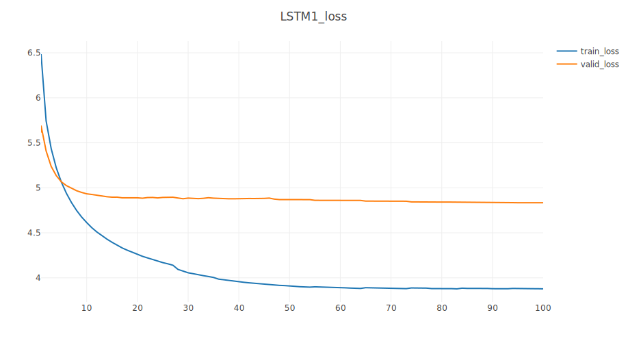

##### 2.2. LSTM1_original

Use Visdom to visualize training and validation curves. This model achieves **6.43** loss and **622.36** ppl on the **test** set. The training and validation curves are as follows:

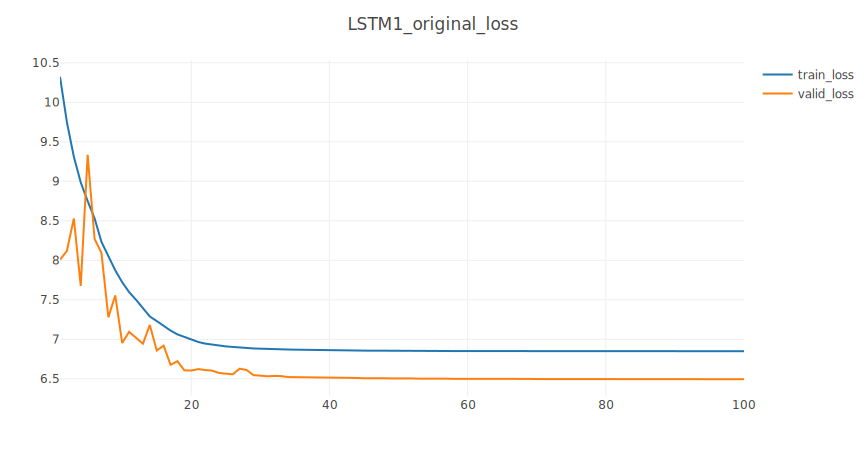


##### 2.3. LSTM2_clip

Use Visdom to visualize training and validation curves. This model achieves **4.76** loss and **116.42** ppl on the **test** set. The training and validation curves are as follows:

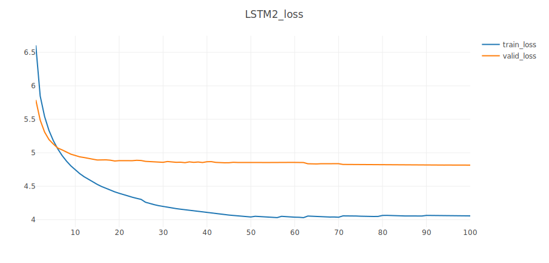

##### 2.4. LSTM4_clip

Use Visdom to visualize training and validation curves. This model achieves **4.87** loss and **130.30** ppl on the **test** set. The training and validation curves are as follows:

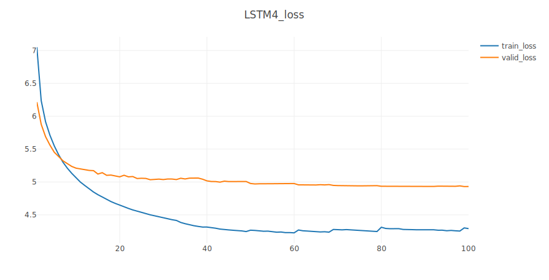

<div STYLE="page-break-after: always;"></div>

##### 2.5. LSTM8_clip

Use Visdom to visualize training and validation curves. This model achieves **6.87** loss and **965.01** ppl on the **test** set. The training and validation curves are as follows:

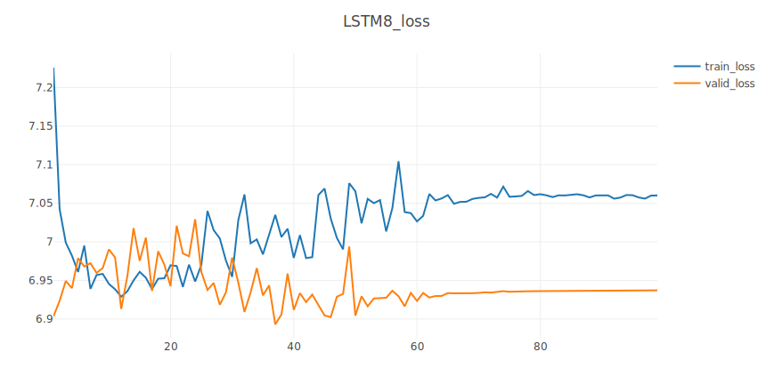

##### 2.6. GRU1_clip

Use Visdom to visualize training and validation curves. This model achieves **4.78** loss and **119.69** ppl on the **test** set. The training and validation curves are as follows:

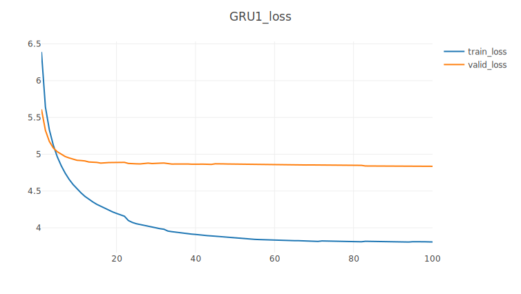

<div STYLE="page-break-after: always;"></div>

## Task B: standard Transformer [30pts]

In task B, I construct a standard Transformer [3] (Attention is All You Need). Use Nvidia RTX 1080 to accelerate my experiment, the following experiments will focus on these aspects:

* Different number of layers 
  * 2 & 4
* Different number of heads
  * 2 & 4
* use gradient clip or not

#### 1. PPL & Time

Sorry for not having enough time to go through all possible situations. The summary results are shown in the table below.

| No.  |      Model      | Train PPL | Valid PPL | Test PPL | ms/batch | Trainable params |
| :--: | :-------------: | :-------: | :-------: | :------: | :------: | :--------------: |
|  1   |  Trans11_clip   |  178.58   |  255.90   |  232.54  |    39    |     20543078     |
|  2   |  Trans22_clip   |  156.45   |  201.86   |  184.38  |    48    |     21086078     |
|  3   | Trans22_orginal |   61.16   |  328.09   |  303.34  |    49    |     21086078     |
|  4   |  Trans42_clip   |  147.38   |  178.75   |  163.98  |    61    |     22172078     |
|  5   |  Trans24_clip   |  151.26   |  195.54   |  178.75  |    49    |     21086078     |

> **ps:** Trans42 means: nlayers = 4 and nhead = 2
>
> **ps2:** clip means: use `gradient clip` and `SGD` optimizer; original means: only use `Adam` optimizer.

**Result analysis:**

* Compare 1, 2, 4 and 5, appropriately increasing `nlayers` and `nhead` can effectively increase ppl. In the limited experimental results, 4 `nlayers` and 2 `nhead` work best. Besides, `nlayers` and efficiency (ms/batch) are positively correlated.
* Compare 2 and 3, `gradient clipping` can significantly improve `Transformer`.

<div STYLE="page-break-after: always;"></div>

#### 2. Training and validation curves.

##### 2.1. Trans11_clip

Use Visdom to visualize training and validation curves. This model achieves **5.45** loss and **232.54** ppl on the **test** set. The training and validation curves are as follows:

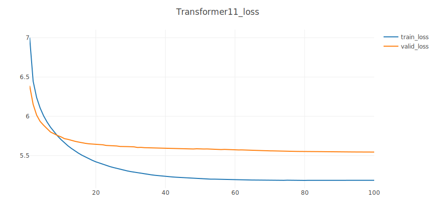

##### 2.2. Trans22_clip

Use Visdom to visualize training and validation curves. This model achieves **5.22** loss and **184.38** ppl on the **test** set. The training and validation curves are as follows:

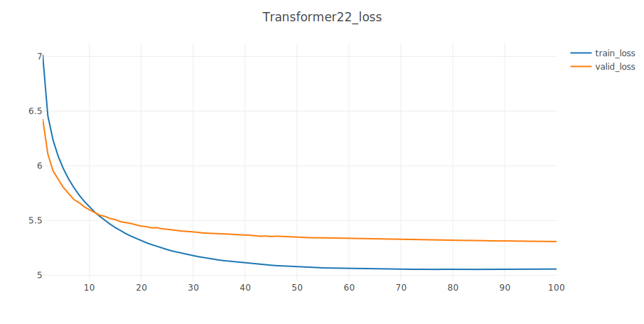

<div STYLE="page-break-after: always;"></div>

##### 2.3. Trans22_original

Use Visdom to visualize training and validation curves. This model achieves **5.71** loss and **303.34** ppl on the **test** set. The training and validation curves are as follows:

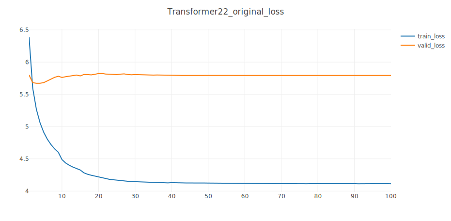

##### 2.4. Trans42_clip

Use Visdom to visualize training and validation curves. This model achieves **5.10** loss and **163.98** ppl on the **test** set. The training and validation curves are as follows:

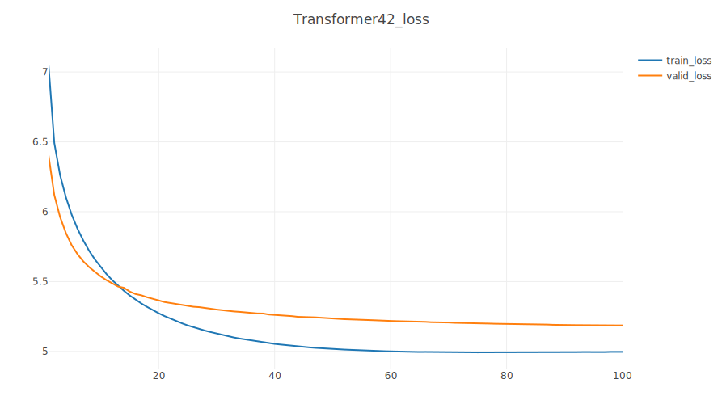

<div STYLE="page-break-after: always;"></div>

##### 2.5. Trans24_clip

Use Visdom to visualize training and validation curves. This model achieves **5.19** loss and **178.75** ppl on the **test** set. The training and validation curves are as follows:

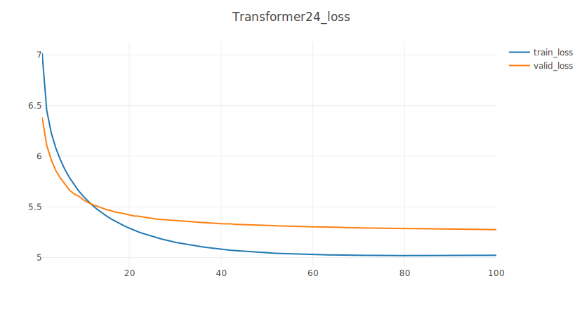

<div STYLE="page-break-after: always;"></div>

## Other Tasks

#### 1. Data Preparation [10pts]

##### 1.1. Text Data Process

Since my `torchtext` version is 0.8.1, and the `data.py` in start-code can only run on 0.9.1, I can only refer to the online tutorial to rewrite `data.py`. There is a `Dictionary` class, which realizes the mutual conversion between `word` and `index`, and records the frequency of each word. In main class `Corpus`, the construction process is as follows:

* Call `add_corpus` to add words from 3 text files such as “wiki.train.tokens” to the `dictionary`

* sort the words by word frequency in descending order

  * this is for using adaptive softmax: it assumes that the most frequent word get index 0

* Call `tokenize` to tokenize the contents of 3 text files

* Call `batchify`. Its function and process are as follows:

  * ```python
    Starting from sequential data, batchify arranges the dataset into columns.
    For instance, with the alphabet as the sequence and batch size 4, we'd get
    # ┌ a g m s ┐
    # │ b h n t │
    # │ c i o u │
    # │ d j p v │
    # │ e k q w │
    # └ f l r x ┘.
    ```

  * Work out how cleanly we can divide the dataset into batch-size parts.

  * Trim off any extra elements that wouldn't cleanly fit (remainders).

  * Evenly divide the data across the batch-size batches.

* Finally, we can call `get_batch` to get `data` and `target`.

  * ```python
    get_batch subdivides the source data into chunks of length args.bptt.
    If source is equal to the example output of the batchify function, with a bptt-limit of 2, we'd get the following two Variables for i = 0:
    # ┌ a g m s ┐ ┌ b h n t ┐
    # └ b h n t ┘ └ c i o u ┘
    Note that despite the name of the function, the subdivison of data is not done along the batch dimension (i.e. dimension 1), since that was handled by the batchify function. The chunks are along dimension 0, corresponding to the seq_len dimension in the LSTM.
    ```

##### 1.2. Image Data Process

Refer to the official Pytorch tutorial [4], the image data processing flow is as follows:

* load all image files, sorting them to ensure that they are aligned
* load images and masks
* note that we haven't converted the mask to RGB, because each color corresponds to a different instance with 0 being background
* convert the PIL Image into a numpy array
* instances are encoded as different colors
*  remove first id, because it is the background
* split the color-encoded mask into a set of binary masks
* get bounding box coordinates for each mask
* convert everything into a torch.Tensor
* suppose all instances are not crowd

#### 2. Technical Details [10pts]

The language modeling task is to assign a probability for the likelihood of a given word (or a sequence of words) to follow a sequence of words. The `nn.TransformerEncoder` consists of multiple layers of `nn.TransformerEncoderLayer`. Along with the input sequence, a square attention mask is required because the self-attention layers in `nn.TransformerEncoder` are only allowed to attend the earlier positions in the sequence. For the language modeling task, any tokens on the future positions should be masked.

The implementation of mask in the code is as follows:

```python
def generate_square_subsequent_mask(self, sz):
    mask = (torch.triu(torch.ones(sz, sz)) == 1).transpose(0, 1)
    mask = mask.float().masked_fill(mask == 0, float('-inf')).masked_fill(mask == 1, float(0.0))
    return mask
```

And it will be used on transformer_encoder in forward:

```python
def forward(self, src, src_mask):
	attention = self.get_attention(src)
    src = self.encoder(src) * math.sqrt(self.ninp)
    src = self.pos_encoder(src)
    output = self.transformer_encoder(src, src_mask)
    output = self.decoder(output)
    return output, attention
```


#### 3. Attention Visualization [10pts]

Use data from the first batch of the test set to visualize attention. It is a 100-word sentence:

```python
<eos> = Robert <unk> = <eos> <eos> Robert <unk> is an English film , television and theatre actor . He had a guest @-@ starring role on the television series The Bill in 2000 . This was
 followed by a starring role in the play Herons written by Simon Stephens , which was performed in 2001 at the Royal Court Theatre . He had a guest role in the television series Judge J
ohn <unk> in 2002 . In 2004 <unk> landed a role as " Craig " in the episode " Teddy 's Story " of the television series The
```

<div STYLE="page-break-after: always;"></div>

The entire attention matrix is as follows:

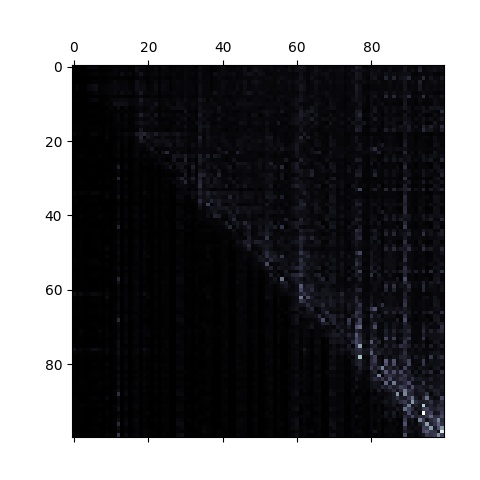

Next, I chose a few different words to observe the results of their attention:

> “Theatre” | “a” | “guest” | “television” | “landed”

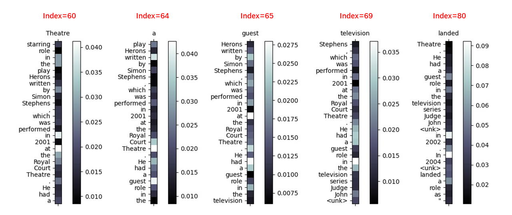

**Result analysis:**

* “Theatre” is more related to “at” and “in”
* “a” is more related to “Theatre” and “guest”
* ...
* The Transformer can learn meaningful attention values.

#### 4. Extra Techniques [10pts]

Refer to the official Pytorch tutorial [4], I use gradient clip to improve my model.

`clip_grad_norm` helps prevent the exploding gradient problem in RNNs / LSTMs.

The comparison results are as follows:

| No.  |      Model      | Train PPL | Valid PPL | Test PPL | ms/batch | Trainable params |
| :--: | :-------------: | :-------: | :-------: | :------: | :------: | :--------------: |
|  1   |   LSTM1_clip    |   48.28   |  125.68   |  119.51  |    43    |     20722478     |
|  2   | LSTM1_original  |  943.23   |  662.08   |  622.36  |    53    |     20722478     |
|  3   |  Trans22_clip   |  156.45   |  201.86   |  184.38  |    48    |     21086078     |
|  4   | Trans22_orginal |   61.16   |  328.09   |  303.34  |    49    |     21086078     |

For detailed results, please refer to the report section of Task A and Task B. As shown in the above table, gradient clip can significantly improve my model, whether it is LSTM or Transformer

## references

[1] Hochreiter, Sepp, and Jürgen Schmidhuber. "Long short-term memory." *Neural computation* 9.8 (1997): 1735-1780.

[2] Chung, Junyoung, et al. "Empirical evaluation of gated recurrent neural networks on sequence modeling." *arXiv preprint arXiv:1412.3555* (2014).

[3] Vaswani, Ashish, et al. "Attention is all you need." *arXiv preprint arXiv:1706.03762* (2017).

[4] https://pytorch.org/tutorials/

